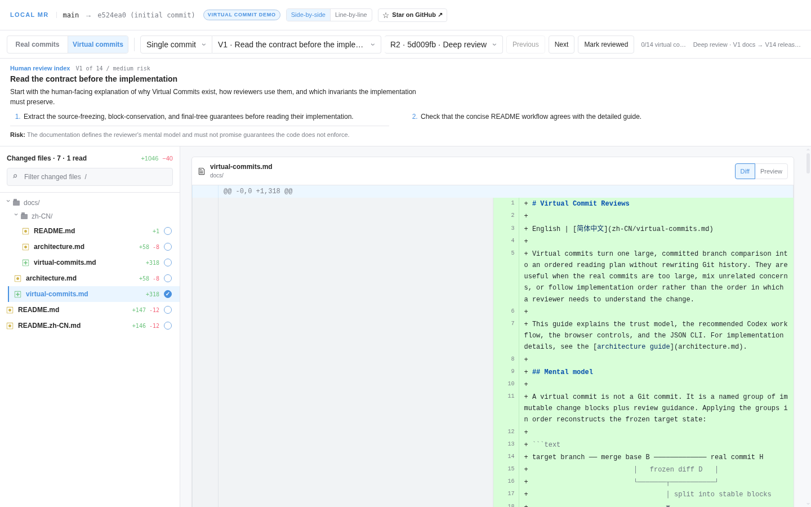

# local-mr

English | [简体中文](README.zh-CN.md)

[](https://github.com/Ne9roni/local-mr/actions/workflows/ci.yml)
[](https://ne9roni.github.io/local-mr/)
[](LICENSE)

**AI wrote a pile of AI slop. Your name is still on the MR.**

**Virtual commits are virtual. Your accountability is not.**

**Virtual Commit** does not turn it into good code. It only rearranges the committed Diff into an order a human can review: documentation and contracts first, then interfaces, critical paths, risky behavior, and tests—with generated noise safely left for last.

Real commits stay untouched. Not a line of code disappears. You still own the change. At least now you can see what you own.

## Reorder the review, not the history

Real commits record how the code was written. That is not always the order in which the code makes sense. When an agent changes many files in one pass, Virtual Commit adds a second, review-only route through exactly the same change.

```text
real history:     C1 ───────────── C2 ───────────── C3
                         freeze the committed Diff
                                      │
review route:       V1 docs/contracts → V2 interfaces → V3 risky behavior → V4 tests

                  complete Real range = complete Virtual range
```

| | Real commits | Virtual commits |
| --- | --- | --- |
| Purpose | Record how the branch actually changed | Make the same change easier to review |
| Order | Git first-parent order | Agent-planned dependency and risk order |
| Effect on Git | Read-only | Read-only; creates no Git commit or object |
| Complete range | Frozen committed Diff | The exact same frozen committed Diff |

The agent proposes the route; local-mr does not blindly trust it. The engine freezes an exact base-to-commit source, divides it into stable change blocks, rejects missing or duplicate blocks, materializes every cumulative Virtual state in isolation, and verifies that the final tree matches the frozen real tree. Intermediate Virtual states may be incomplete because they are reading steps, not replacement history.

Install the bundled Codex Skill once, then choose the review depth and reading order you want:

```bash
local-mr virtual-commit install-skill codex
```

```text
Use local-mr virtual commits to organize the committed changes against
origin/main. Use Deep review: put documentation and contracts first, then
dependencies, high-risk behavior, integrations, and tests. Keep generated
files last. Show me the ordered Virtual Commit titles before generating the
review page.
```

The browser opens the generated route in the normal Diff workspace with **Real / Virtual** switching, Single commit and Commit range modes, previous/next navigation, risk and review-focus guidance, immutable revisions, and reviewed progress. See [Virtual Commit reference](#virtual-commit-reference) for the complete workflow and [the dedicated guide](docs/virtual-commits.md) for the manifest and JSON CLI.

## Watch local-mr review its own AI slop

The [interactive Demo](https://ne9roni.github.io/local-mr/) is generated from this repository's first two commits. Real shows the entire Virtual Commit implementation as one AI-sized commit. Virtual turns that exact Diff into a six-step Overview or a fourteen-step Deep review—documentation first, release metadata last. Same code; fewer pages to stare at like you have been asked to proofread a phone book.

[](https://ne9roni.github.io/local-mr/)

[Open the Demo →](https://ne9roni.github.io/local-mr/) Switch between Real and Virtual, change revision and range, expand context, preview Markdown, then use the repository link there if local-mr earned a Star.

## Why local-mr?

- **Review the whole branch.** Start with the latest committed branch state, then explicitly include the current worktree when you are ready to review uncommitted work.
- **Review how the branch evolved.** Jump to any individual commit or compare a contiguous range; optionally treat the current worktree as the final checkpoint.
- **Keep the review local.** The server listens only on the loopback interface behind a random path token, and worktree snapshots use a temporary index.

## Quick start

Requires Linux or WSL, Git, and Node.js 22 or later. Try it without a global install:

```bash
cd /path/to/your/repo
npx --yes --package=github:Ne9roni/local-mr local-mr
```

Or install a self-contained copy from source:

```bash
git clone --depth 1 https://github.com/Ne9roni/local-mr.git ~/local-mr
~/local-mr/scripts/install.sh
```

The source installer places the command at `~/.local/bin/local-mr` and the runtime at `~/.local/share/local-mr`. Make sure `~/.local/bin` is on your `PATH`, then run:

```bash
cd /path/to/your/repo
local-mr
```

For development, run `npm ci` followed by `npm run install:link` from the source checkout. Set `LOCAL_MR_PREFIX` to change the source install prefix.

## Features

- Committed, staged, unstaged, and untracked changes in one review
- Directory tree with per-file read and unread state
- Individual commits, contiguous commit ranges, and an explicitly selected worktree checkpoint
- Side-by-side and line-by-line diffs with expandable omitted context
- Language-aware syntax highlighting with GitHub-inspired light and dark palettes
- Safe Markdown preview with Mermaid rendering and HTML sanitization
- Dark, light, and system color modes
- Automatic Windows browser launch from WSL
- Lazy-loaded file diffs and bounded caches for large reviews
- Agent-guided virtual commits that reorder a frozen large diff for human reading

## Usage

```bash
local-mr                         # Detect the target branch automatically
local-mr origin/main             # Use an explicit target branch
local-mr origin/release --dark   # Force dark mode
local-mr --line                  # Use a line-by-line diff
local-mr --no-open               # Do not open a browser automatically
```

The target branch is detected in this order:

1. `LOCAL_MR_BASE`
2. `branch.<name>.local-mr-target`
3. VS Code merge-base configuration
4. `origin/HEAD`, `origin/main`, `origin/master`, `main`, or `master`

Remember a target branch for the current branch:

```bash
git config branch."$(git branch --show-current)".local-mr-target origin/release
```

## Virtual Commit reference

Real commit history records how a change was built; it is not always the best order in which to review it. A large AI-produced commit may mix foundations, risky behavior, integrations, tests, and generated files. Virtual commits let an agent reorganize that same change into a dependency-aware reading route without rebasing, cherry-picking, or creating any Git object in the repository.

A virtual commit is a named set of frozen change blocks with an intent, one to three anchored review-focus notes, and a risk assessment. It exists only inside local-mr:

```text
merge base B ───────────── selected real commit H
             frozen diff D
                  │ split into stable blocks
                  ▼
             V1 → V2 → … → Vn

       every block in D appears exactly once
       state after Vn equals the frozen state at H
```

This makes Virtual commits useful for reviewing large or poorly partitioned changes, teaching the architecture of a branch, or putting high-risk behavior before mechanical edits. They are reading steps, not replacement history: an intermediate Virtual state is allowed to be incomplete or uncompilable, and nothing is ever applied back to Git.

### How it works

1. `snapshot` freezes exactly one committed comparison from the target merge base to a selected real commit. Worktree endpoints are rejected, so staged, unstaged, untracked, and other uncommitted changes cannot enter the source.
2. Ordinary text changes are divided into stable contiguous blocks. Renames, binary files, submodules, mode changes, and other unsafe-to-split changes remain whole file-level blocks.
3. The agent reads the file/block catalog lazily and writes a manifest that assigns every block to one ordered Virtual commit.
4. local-mr rejects unknown, missing, or duplicate blocks and invalid review anchors. It then materializes every cumulative state in an isolated temporary Git repository and verifies that the final tree equals the frozen target tree.
5. The accepted plan is stored as an immutable revision and opened in the same Diff workspace as Real review. A later edit appends a revision instead of overwriting history; each revision retains the exact frozen branch commit used to generate it.

The source records exact base, head, and target SHAs, a SHA-256 of the canonical patch, and content-addressed copies of affected files. Real and Virtual use the same binary/full-index diff format, so their **complete ranges have the same patch and rendered Diff**. Arbitrary partial ranges need not match: Real follows first-parent Git history, while Virtual intentionally follows a different reading order.

The workflow is a read-only projection. It never changes the worktree, real index, object database, refs, commits, Git configuration, remotes, or a remote MR.

### Use it with Codex

Install the bundled official Skill once:

```bash
local-mr virtual-commit install-skill codex
```

Use `--force` only when intentionally updating an existing installed copy. Then start Codex in the repository and ask for a review depth and reading order, for example:

```text
Use local-mr virtual commits to organize the committed changes against
origin/main. Use Deep review with a dependency-aware, core/risk-first reading
order. Show me the ordered Virtual Commit titles before generating the review
page.
```

Review depth and reading order are independent. **Overview** usually creates 5–8 broad, mostly whole-file chapters; **Deep review** usually creates 10–20 narrower steps and may place blocks from one large file in different Virtual Commits. If depth is omitted, the Skill asks before taking a snapshot or analyzing the comparison and recommends Deep review for large or AI-produced changes. If no reading order is supplied, it uses dependency-aware core/risk-first. After analyzing the frozen source, it displays the complete ordered Virtual Commit title list and waits for explicit approval. Only then does it submit the manifest and open the tokenized loopback review in the browser without relaying its URL.

The human chooses the review depth and approves the proposed reading plan; the model analyzes and prepares it. local-mr independently enforces source immutability, block conservation, final-tree equality, persistence, and Git safety.

### Review Real and Virtual side by side

The source switch at the top is part of every review, so bare `local-mr` and Virtual Review links always open the same workspace. The bare command is the stable, live page for one repository, branch, and target; it automatically discovers a saved Virtual Review for that identity. If the branch moves afterward, the plan does not disappear: the switch reads **Virtual · stale** and, after you enter it, a persistent banner names both the frozen commit and current `HEAD` while warning that later commits are not included. With no saved match, the Virtual side stays visible and explicitly unavailable instead of making the page change shape. Both sources share the changed-file tree, lazy loading, side-by-side and line-by-line layouts, syntax highlighting, read markers, omitted-context expansion, Markdown/Mermaid preview, mobile drawer, and exactly two comparison modes:

- **Single commit** jumps to any commit in the current source's order. For `Vn`, it compares the cumulative state after `Vn-1` with the state after `Vn`.
- **Commit range** compares an inclusive contiguous interval. For `V3…V6`, the left side is the state after `V2` and the right side is the state after `V6`. A one-commit range is valid.

Real opens on the complete committed **Commit range**, follows first-parent order, and may expose the worktree as an explicit final checkpoint. A Real range beginning at the first review commit is anchored to the merge base, preventing target-only changes from reappearing after the target was merged into the feature branch. Virtual opens in **Single commit** at `V1`, then follows `V1`, `V2`, … order with previous/next navigation, revision selection, and revision-local reviewed progress. The revision selector identifies each plan's frozen branch commit by SHA, subject, and branch; revisions in one review may intentionally point to different commits. The shared context panel shows the real Git subject/body or the Virtual intent, review focus, risk, and anchored guidance.

When a stale plan is entered from the live Real page, its Real button returns to that same live page; a historical Virtual link opened directly still uses the frozen Real comparison for exact source-to-source verification. Switching to frozen Real and back preserves the exact Virtual revision, mode, endpoints, and focused file. Frozen Real opens with the snapshot's base, head, and target SHAs, so later repository drift or stale target configuration cannot silently change the file set. There is no Pushes mode; legacy `mode=push` URLs are accepted only as aliases and normalized to Single commit or Commit range.

### Direct JSON CLI

The bundled Skill uses a versioned, automation-friendly interface that is also available directly:

```text
local-mr virtual-commit snapshot [--target REF] [--mode MODE --from VALUE --to VALUE]
local-mr virtual-commit show SOURCE_ID [--file PATH | --block ID | --full]
local-mr virtual-commit create SOURCE_ID [--manifest FILE] [--review ID] [--expected-revision N] [--no-open]
local-mr virtual-commit open REVIEW_ID [--revision N] [--no-open]
local-mr virtual-commit list
local-mr virtual-commit delete REVIEW_ID [--revision N]
local-mr virtual-commit prune
```

The common manual lifecycle is:

```bash
local-mr virtual-commit snapshot --target origin/main
local-mr virtual-commit show SOURCE_ID --file src/router.ts
local-mr virtual-commit create SOURCE_ID --manifest manifest.json
local-mr virtual-commit list
local-mr virtual-commit open REVIEW_ID --revision 2
local-mr virtual-commit delete REVIEW_ID
local-mr virtual-commit prune
```

`show` can return one file, one block, or the full patch. `create` reads stdin when `--manifest` is omitted; `--review REVIEW_ID` appends an immutable revision, and `--expected-revision N` prevents racing updates. `list` reports the frozen branch commit for every revision. `create` and `open` launch the browser unless `--no-open` is supplied. Successful commands emit one JSON object on stdout; failures emit structured JSON on stderr.

Snapshots are self-contained and remain reviewable if the repository moves or disappears. They are kept outside the repository under `$XDG_STATE_HOME/local-mr/virtual-reviews`, or `~/.local/state/local-mr/virtual-reviews` when `XDG_STATE_HOME` is unset. They contain private source code and persist until explicitly managed, so protect that directory and use `delete` followed by `prune` to remove reviews and their now-unreferenced snapshots/blobs. Virtual-commit commands neither contact nor modify a remote MR, nor change the worktree, index, refs, commits, or repository object database.

See the [complete Virtual Commit guide](docs/virtual-commits.md) for the manifest schema, explicit source selection, revision workflow, validation errors, storage model, and cleanup instructions.

## Privacy and security

local-mr serves each review on `127.0.0.1` behind a random path token and never writes to the repository's real Git index. The page can still contain private source code, so do not share review URLs, runtime logs, or unsanitized screenshots. Report vulnerabilities privately as described in [SECURITY.md](SECURITY.md).

CI scans the complete Git history with a pinned Gitleaks image. Contributors who already have Gitleaks installed can optionally enable the repository's staged pre-commit hook. See the [contributing guide](CONTRIBUTING.md#sensitive-data) for details.

## Requirements and limitations

- Linux or WSL
- Git
- `curl` and GNU coreutils (`sha256sum`)
- Node.js 22 or later and npm
- A desktop browser; `google-chrome` is required only for contributor browser tests

## Development

```bash
nvm use
npm ci
npm run verify
```

`npm run verify` runs syntax checks, unit and integration tests, static Demo verification, and the real Chrome regression suite. The Demo is pinned to this repository's first two commits, so shallow development checkouts must fetch the complete history. GitHub Actions runs the core checks on Node.js 22 and 24.

See [the architecture guide](docs/architecture.md) for version modeling, cache invalidation, runtime paths, and security boundaries. See [CONTRIBUTING.md](CONTRIBUTING.md) for the complete contributor workflow and [CHANGELOG.md](CHANGELOG.md) for release history.

## Uninstallation

```bash
npm run uninstall:local  # From the source checkout
```

Uninstallation preserves read state and virtual-review snapshots under `$XDG_STATE_HOME/local-mr`, or `~/.local/state/local-mr` when `XDG_STATE_HOME` is unset.

## Acknowledgements and license

Diff rendering is powered by [diff2html](https://github.com/rtfpessoa/diff2html), with syntax highlighting from [highlight.js](https://github.com/highlightjs/highlight.js). Markdown preview uses [marked](https://github.com/markedjs/marked), [DOMPurify](https://github.com/cure53/DOMPurify), and [Mermaid](https://github.com/mermaid-js/mermaid). See [THIRD_PARTY_NOTICES.md](THIRD_PARTY_NOTICES.md) for attribution.

local-mr is available under the [MIT License](LICENSE).
